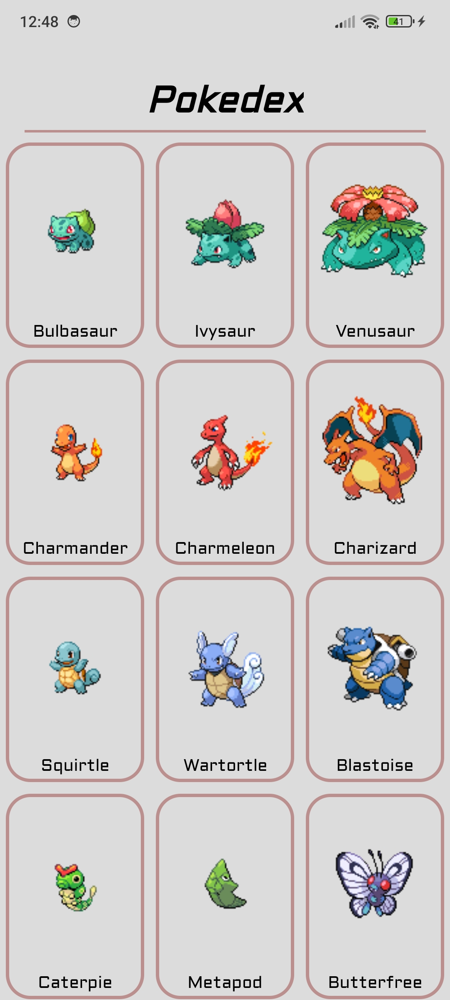
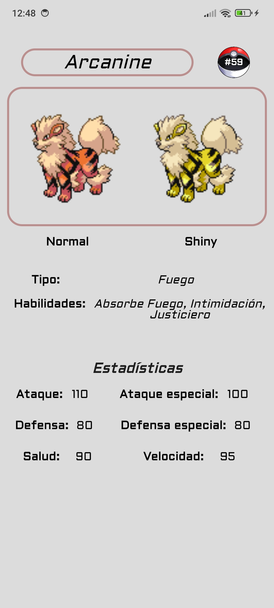

# Pokedex

Esta es una aplicación de Pokedex desarrollada en Android Studio usando Java. La aplicación utiliza la API PokeAPI para obtener información sobre diferentes Pokémons.

## Badges


## Características

- RecyclerView que muestra la imagen y el nombre de los Pokémon.
- Detalles del Pokémon en una nueva pantalla al hacer clic en un elemento del RecyclerView.
- Imágenes del Pokémon en su forma normal y shiny.

## Demo

### Lista de pokemon

<p align="center">
   
</p>

### Detalles del pokemon

<p align="center">
   
</p>

### Vídeo demostración

<p align="center">
   
</p>

## Deployment

1. Clona este repositorio:

   ```sh
      git clone https://github.com/JvrGrc/Pokedex.git
   ```

2. Abre el proyecto en Android Studio.

3. Compila y ejecuta la aplicación en un dispositivo o emulador Android.

## API Reference

Esta aplicación utiliza [PokeAPI](https://pokeapi.co/) para obtener la información de los Pokémon.

## License

[MIT](https://choosealicense.com/licenses/mit/)
